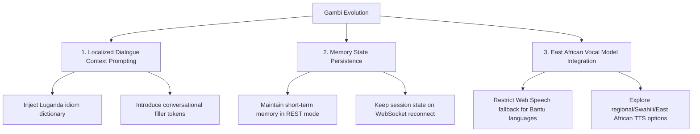

# Gambi Evolution & Next-Level Development Plan

This document details the analysis of the current state of **Gambi**, categorizes its challenges, and maps out the concrete steps for its next level of development.

---

## 1. Current Reality & Challenges

### Current Reality
* **Functional Core**: Gambi has a working Next.js frontend and a FastAPI backend with dual operational modes:
  * **REST Mode**: Captured audio is sent to `POST /audio`, transcribed via Whisper, responded to via GPT-4o-mini, and spoken using OpenAI TTS (or Web Speech API fallback).
  * **WebSocket Mode**: Real-time bidirectional streaming connecting the browser microphone directly to the OpenAI Realtime API.
* **Conversational Foundation**: The system successfully handles single-turn voice exchanges and simple back-and-forth speech.

### Current Challenges
* **Mechanical Tone**: The voice delivery is stiff. In fallback settings (Web Speech API), the browser pronounces Luganda text phonetically using US/UK English voices, resulting in an unnatural and disjointed audio output. Even with OpenAI Realtime's `shimmer` voice, the phonetic output lacks native East African intonation.
* **Poor Grammar Quality**: The LLM frequently translates idioms literally from English to Luganda, leading to incorrect noun class prefixes, unnatural syntax, and awkward phrasing.
* **Incoherency & Lack of Presence**: The system lacks conversational placeholders ("Aha", "Kale nno"), and in REST mode, it is completely stateless (there is no history buffer, meaning Gambi has zero short-term memory).

---

## 2. Root Cause Analysis (Categorized)

To solve these challenges, we must segment them into their respective technical domains:

| Category | Specific Challenge in Gambi | Root Cause |
| :--- | :--- | :--- |
| **Prompt Problems** | Stiff responses, direct translations, lack of conversational warmth. | The system prompt contains rules but lack concrete, conversational, few-shot Luganda dialogue patterns and localized etiquette constraints. |
| **Model Problems** | Grammatical errors in Luganda, incorrect noun class concord agreements. | `gpt-4o-mini` is a general LLM with limited training on low-resource Bantu languages. It defaults to literal translations of English concepts. |
| **Data Problems** | No context awareness in REST mode; inability to hold a natural thread. | **Stateless API design**: The REST endpoint (`POST /audio`) processes each turn in isolation, completely omitting conversation history. |
| **Voice Problems** | Phonetic butchering of Luganda words; robotic or foreign accents. | **TTS Engine mismatches**: Using English browser voices (`Microsoft Zira`, `Samantha`) to read Luganda text. OpenAI's `shimmer` voice is clean but speaks with a Western accent. |
| **UI Problems** | Interaction feels rigid and lacks conversational "flow." | The client-side VAD (Voice Activity Detection) is a simple volume threshold that cuts off speech too early or late, and the UI lacks ambient "breathing" state indicators. |

---

## 3. Recommended Roadmap & Evolution Strategy

### 3.1 The Three Highest-Impact Improvements

1. **Localized Dialogue Prompting with Few-Shot Examples (Prompt & Model)**
   * **Why**: Overrides the LLM's default literal English-to-Luganda translation behavior.
   * **Action**: Inject a comprehensive list of localized conversational patterns, common idioms, and rules for Bantu noun prefix agreements directly into the system prompt.
2. **Session Memory & Context Buffer (Data)**
   * **Why**: Resolves the incoherency and statelessness in REST mode.
   * **Action**: Implement a backend history buffer (e.g., in-memory or Redis-based sliding window) to append the last 5 turns of conversation context to the prompt.
3. **Regional TTS Synthesis Strategy (Voice)**
   * **Why**: Solves the mechanical/robotic sound of English voice engines trying to read Luganda.
   * **Action**: Completely disable Web Speech English voice fallbacks for Luganda. Rely entirely on backend-generated TTS audio files, and explore specialized Bantu-language voice synthesis models or configure the system to prioritize Swahili-localized accents.

---

### 3.2 72-Hour Rapid Improvement Plan
If we only have 72 hours, we should prioritize changes that require minimal infrastructure shifts but yield the highest immediate change in user perception:

* **Hour 0–12: Prompt Rewrites (System Prompt & Session Config)**
  * Update `gpt_system_prompt` in [config.py](file:///d:/Work%20Projects/Positrust-websites/gamba-ai/backend/blueprawn_ai_sim/config.py) and the session update configuration in [app.py](file:///d:/Work%20Projects/Positrust-websites/gamba-ai/backend/blueprawn_ai_sim/app.py).
  * Embed strict guidelines on conversational Luganda (e.g., using polite Bantu prefixes, short sentence structures, and local slang where appropriate).
  * Provide 3 full back-and-forth few-shot Luganda dialogue turns.
* **Hour 12–36: REST Mode History Buffer**
  * Modify [responder.py](file:///d:/Work%20Projects/Positrust-websites/gamba-ai/backend/blueprawn_ai_sim/llm/responder.py) to accept an optional session history array.
  * Update [app.py](file:///d:/Work%20Projects/Positrust-websites/gamba-ai/backend/blueprawn_ai_sim/app.py)'s `POST /audio` to store history per session (using a simple dictionary keyed by a browser session ID).
* **Hour 36–60: Disable Web Speech fallback for Luganda**
  * Update [speechSynthesis.ts](file:///d:/Work%20Projects/Positrust-websites/gamba-ai/frontend/src/utils/speechSynthesis.ts) to throw a soft error or return if the language is Luganda and no native voice is present. Instead of attempting to read Luganda with Microsoft Zira, fallback to a visual text indicator while making sure the backend TTS is used as the primary pipeline.
* **Hour 60–72: Latency & VAD Fine-Tuning**
  * Adjust VAD settings in [AudioInterface.tsx](file:///d:/Work%20Projects/Positrust-websites/gamba-ai/frontend/src/components/AudioInterface.tsx): Change `SILENCE_DURATION_MS` and `SILENCE_THRESHOLD` to optimize natural turn-taking and avoid cutoffs.

---

### 3.3 What Gambi Should Feel Like After the Next Cycle

After these updates, Gambi should transition from a "transcribe-and-command" machine into **a warm, natural East African digital presence**:

* **Presence**: Rather than responding instantly and flatly like a search engine, Gambi's responses will start with soft conversational markers ("Aha", "Kale nno", "Eeeh").
* **Identity**: The voice will feel warm, friendly, and unmistakably local. The syntax will reflect actual Luganda conversation patterns rather than literal English translations.
* **Continuity**: The user can say "Hello", then ask "What is the weather?", followed by "What about tomorrow?" — and Gambi will understand "tomorrow" refers to the weather, maintaining a smooth thread without needing repeated context.
